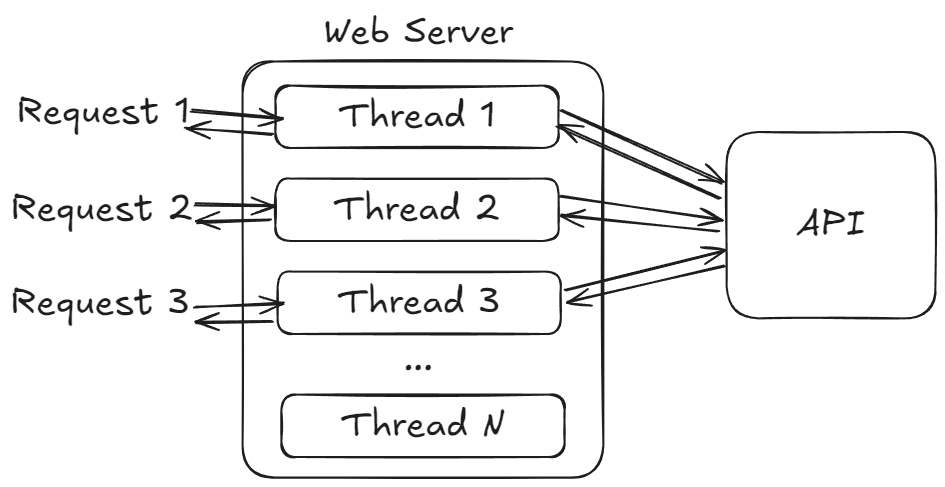
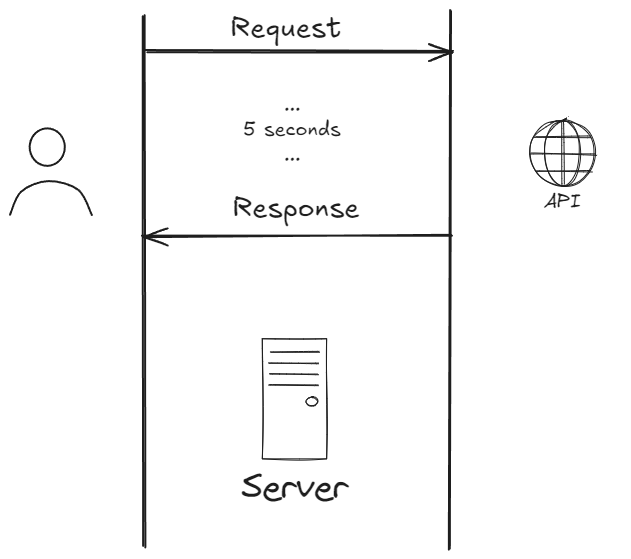
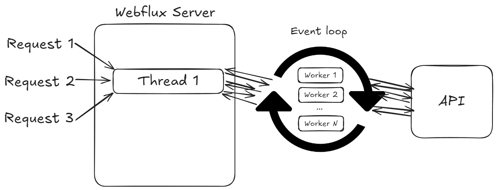
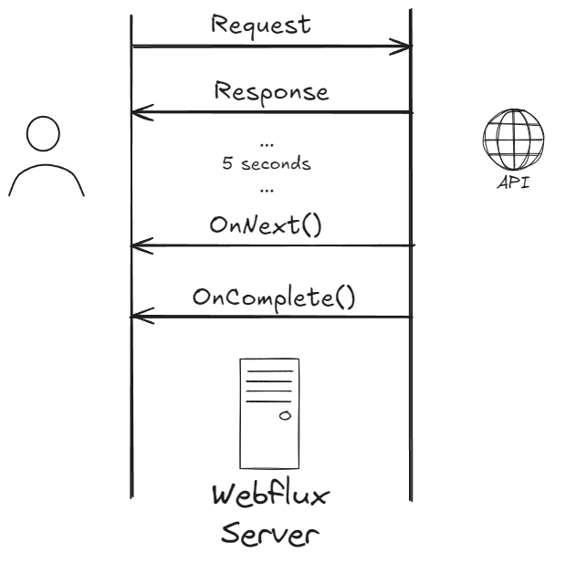

# Reactive programming in Java and Spring
- design patter that focuses on use of **asynchronous** and **non-blocking** data **streams** to handle data and **events**
- Java developers are lazy - we never have to think about concurrency

### Blocking server (ETL Manager)

### Non-Blocking server (WFO Analytics Core)

